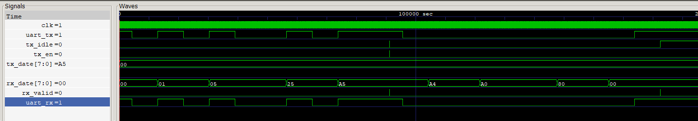
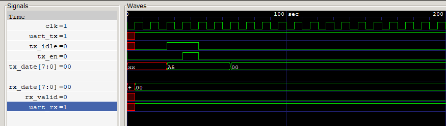

# uart_core
UART 底层核心模块说明

这是一个全双工 UART 底层硬件模块，发送端（TX）与接收端（RX）相互独立、可同时工作。

模块参数配置

CLK_HZ      ：clk的时钟周期。

BAUDRATE    ：串口波特率。

CHECK_BIT   ：校验设置，0无校验，1奇校验，2偶校验。

STOP_BIT    ：停止位，1位为1bit，2位为1.5bit，3为2bit。

发送端（TX）工作逻辑

发送使能由 tx_en 控制，状态由 tx_idle 指示。
当 tx_idle = 1（发送空闲）且 tx_en 产生上升沿时，启动发送，发送数据为 tx_data。tx_idle = 1 表示模块空闲可发送；tx_idle = 0 表示正在发送。

接收端（RX）工作逻辑

接收模块持续监听串口数据，无需使能。当 rx_valid 出现上升沿时，表示一帧数据接收完成。此时 rx_data 为有效接收数据。

仿真文件说明

tb_uart_core.v：UART 核心模块的测试平台。

仿真工具：iverilog

仿真功能：实现 UART 自收发回环测试，发送两个 8bit 数据 0xa5,0x00，验证模块收发功能正确性。

下图为iverilog的仿真波形图：

下图为局部放大显示：
